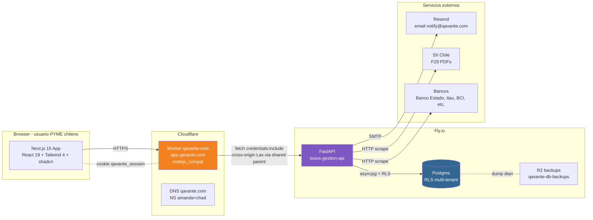

# Arquitectura — Qavante (Fase 1)

Vista de alto nivel del sistema. Para decisiones específicas con rationale, ver [docs/adr/](./adr/).

> **Deliverable de C0-18** — diagrama simplificado de cliente → API → DB, sin entrar en detalle de cada módulo de producto (eso vive en el Documento Maestro).

## Diagrama

## Componentes

### Frontend: Worker `qavante-web`

- **Hostname:** [app.qavante.com](https://app.qavante.com) — custom domain bindeado vía [wrangler.toml `[[routes]]`](../wrangler.toml).
- **Stack:** Next.js 15 (App Router) + React 19 + TypeScript strict + Tailwind 4 + shadcn/ui sobre design system Qavante (Anexo B del doc maestro).
- **Runtime:** Cloudflare Workers vía adapter [`@opennextjs/cloudflare`](https://opennext.js.org/cloudflare). Bundle empaquetado para `workerd` con `compatibility_flags = ["nodejs_compat"]`. Ver [ADR-0001](./adr/0001-cloudflare-workers-vs-pages.md).
- **Auth (cliente):** cookie httpOnly `qavante_session` (Domain=.qavante.com, SameSite=Lax, Secure, ver [ADR-0003](./adr/0003-api-qavante-com-shared-parent.md)). Middleware Next.js en `src/middleware.ts` valida cookie y redirige a `/login` si falta. El interceptor en [`src/lib/api/client.ts:64`](../src/lib/api/client.ts#L64) hace refresh automático en 401.
- **State management:** TanStack Query (server state) + Zustand (UI state local). React-hook-form + zod para validación.
- **Deploy:** push a `main` dispara [.github/workflows/deploy-cloudflare.yml](../.github/workflows/deploy-cloudflare.yml) — `npm run build:cloudflare` + `wrangler deploy` + smoke test post-deploy contra prod.

### Backend: FastAPI `tooxs-gestion-api`

- **Hostname:** [api.qavante.com](https://api.qavante.com) (CNAME → `tooxs-gestion-api.fly.dev`, DNS-only en Cloudflare). Ver [ADR-0003](./adr/0003-api-qavante-com-shared-parent.md).
- **Stack:** FastAPI sobre Python 3.12, async, Postgres con `asyncpg`. JWT para auth (access 15min + refresh 7d).
- **Multi-tenancy:** Row-Level Security en Postgres por columna `tenant_id`. Aislamiento validado en staging con segundo tenant (Kit C0-17).
- **Tools del Asistente** (Anexo G, Sprint C2+): expone funciones que consultan Pulso, Caja, Forecast, etc. Ver [ADR-0004](./adr/0004-asistente-qavante-anti-patterns.md) para reglas de exposición.
- **Repo:** `qavante-api` (branding interno) — el nombre operativo de la Fly app sigue siendo `tooxs-gestion-api` (decisión de rename diferida, Kit sec 1.1).

### Datos: Postgres + R2 backups

- **Postgres** en Fly (managed). RLS activado en migration 0008 (staging), pendiente activar en prod (Kit C0-17 DoD).
- **R2 backups** en Cloudflare — Worker `qavante-db-backups` dumpa la DB diariamente.

### Servicios externos

| Servicio            | Uso                                                         | Notas                                                                         |
| ------------------- | ----------------------------------------------------------- | ----------------------------------------------------------------------------- |
| **Resend**          | Email transaccional (invitaciones, password reset, alertas) | Remitente `notify@qavante.com`.                                               |
| **SII Chile**       | Scrape de F29 PDFs (declaraciones de IVA)                   | URL pattern `?folio&rut&form=029&codInt`. Backend hace el scrape.             |
| **Bancos chilenos** | Movimientos bancarios (Banco Estado, Itaú, BCI, etc.)       | Backend tiene scrapers por banco. Lo conectan los usuarios desde `/app/caja`. |

## Flujos críticos

### Login

1. Usuario abre `https://app.qavante.com/login` (route público en Next.js).
2. Submit del form → `POST https://api.qavante.com/api/auth/login` con `{rut, password}` (`credentials: 'include'`).
3. Backend valida, emite JWT + setea cookie `qavante_session` con `Domain=.qavante.com`.
4. Frontend redirige a `/inicio`. Cookie viaja en cada request subsecuente al backend porque comparten parent `.qavante.com` con `SameSite=Lax`.

### Request autenticado típico (Caja, Cobrar, etc.)

1. Componente React invoca `api.get("/api/cash/pulso")` (cliente en `src/lib/api/client.ts`).
2. Cliente envía con `credentials: 'include'` — la cookie viaja automáticamente.
3. Si 401, interceptor llama `POST /api/auth/refresh`; si OK, retry; si falla refresh, redirect a `/login?redirect=<path>`.
4. Respuesta del backend respeta el formato canónico del Anexo C.3 (`{ code, detail }`) — mapeado a textos amigables por [src/lib/api/error-messages.ts](../src/lib/api/error-messages.ts).

### Invitar usuario (Sprint C0-15)

1. Owner/admin desde `/app/administracion/usuarios` invoca `POST /api/users` con `{email, role}`.
2. Backend crea registro en `user_invitations` con token único, envía email vía Resend con link a `https://app.qavante.com/aceptar-invitacion?token=xxx`.
3. Invitado abre el link (route público), setea clave inicial, queda autenticado.

## Decisiones clave (ADRs)

| ADR                                                       | Decisión                                                                                          |
| --------------------------------------------------------- | ------------------------------------------------------------------------------------------------- |
| [ADR-0001](./adr/0001-cloudflare-workers-vs-pages.md)     | Cloudflare Workers vía `@opennextjs/cloudflare` (no Pages).                                       |
| [ADR-0002](./adr/0002-dominio-oficial-qavante-com.md)     | Dominio `qavante.com` (GoDaddy + Cloudflare DNS), no `qavante.cl`.                                |
| [ADR-0003](./adr/0003-api-qavante-com-shared-parent.md)   | Backend en `api.qavante.com` para shared parent con FE (cookie cross-subdomain con SameSite=Lax). |
| [ADR-0004](./adr/0004-asistente-qavante-anti-patterns.md) | Asistente Qavante — separación reasoning/content, no exposición de tool calls.                    |

## Lo que NO está en Fase 1

- OAuth Google / Microsoft (Fase 2).
- App móvil nativa (Fase 2 — la app es responsive desde C0).
- Sandbox / playground para desarrolladores externos.
- Multi-país (solo Chile en Fase 1).
- ML / forecast con modelos entrenados (Fase 1 usa drivers rule-based, ver doc maestro sec 6).

## Referencias

- [Documento Maestro v2.6.4](../qavante_fase1_v2.6.4.docx) — visión de producto, módulos, drivers, DoD.
- [QAVANTE_SPRINT_C0_KIT.md](../QAVANTE_SPRINT_C0_KIT.md) — tickets atómicos del Sprint C0.
- [docs/adr/](./adr/) — Architecture Decision Records.
- [docs/operations/](./operations/) — runbooks (Cloudflare Workers, DNS, secrets).
- [docs/backend-contracts/](./backend-contracts/) — contratos HTTP entre FE y BE.
